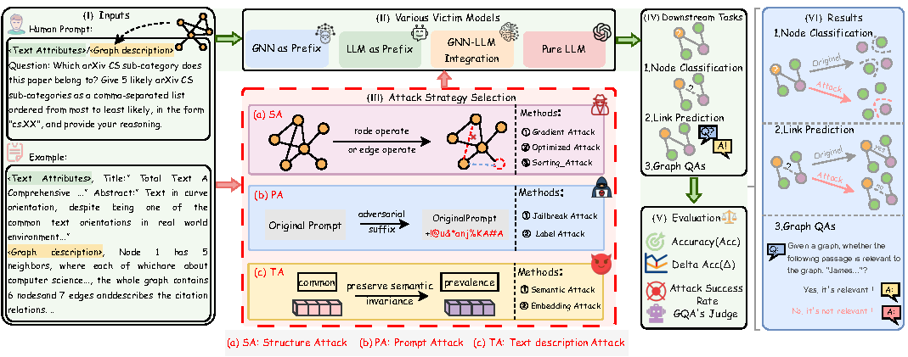

# 📄 [Your Paper Title]

> **GUARF: Graph Large Language Models Unified
Adversarial Robustness Framework for
Multi-dimensional Evaluation**

This repository contains the official implementation of the method proposed in our paper:  
**"[Your Paper Title]"**.

---

## 📊 Framework Diagram

The figure below illustrates the overall architecture / pipeline of our proposed method:

> 💡 The diagram is stored at `assets/framework.png`. Please place your figure in the `assets/` folder and update the filename if needed.

---

## 🚀 Getting Started

